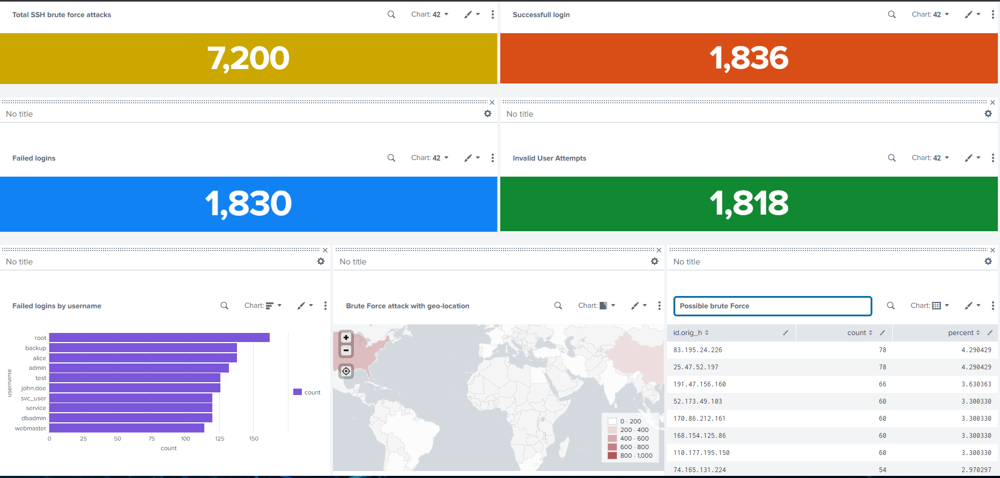
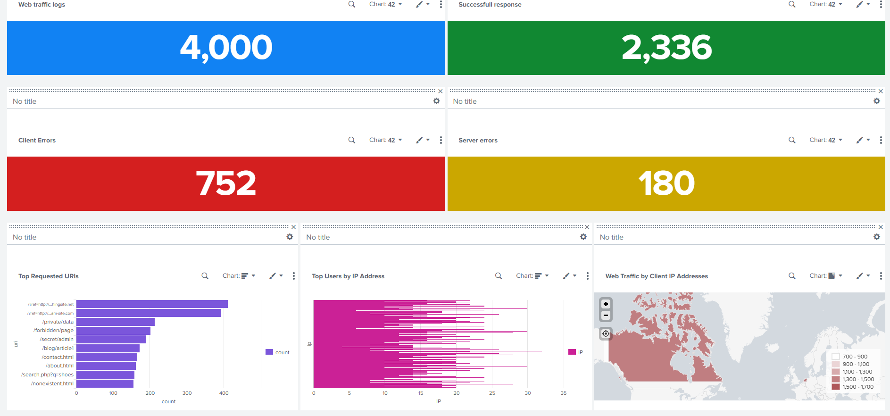

# Splunk Security Dashboards

This project demonstrates how to create security monitoring dashboards in **Splunk SIEM** to analyze system and network logs. The dashboards help identify suspicious activity such as SSH brute-force attacks and abnormal web traffic behavior.

The goal of this project is to practice **log analysis, detection queries, and security visualization using Splunk**.


## Project Overview

Security analysts rely on SIEM dashboards to monitor systems and detect attacks in real time.  
In this project, multiple dashboards were created using Splunk queries to analyze:

- SSH authentication logs
- Web traffic logs
- Failed login attempts
- Client and server errors
- Suspicious activity patterns

These dashboards help security teams quickly detect and investigate potential threats.


## Tools Used

- **Splunk Enterprise** – SIEM platform for log analysis and dashboards  
- **Linux Logs** – Authentication and system logs  
- **Web Traffic Logs** – HTTP access logs  
- **SPL (Search Processing Language)** – Query language used in Splunk  


## Dashboards Implemented

### 1️⃣ SSH Security Dashboard

This dashboard analyzes SSH authentication logs to detect suspicious login activity.

It includes visualizations for:

- Failed SSH login attempts
- Invalid user login attempts
- Successful SSH logins
- Attack frequency over time
- Targeted usernames

Queries used in this dashboard are available in:


Total SSH brute force attacks:

```spl
source="ssh_logs_new.json" host="LinuxServer" sourcetype="_json"
| stats count AS "Total SSH brute force attacks"
```

Successfull login:

```spl
source="ssh_logs_new.json" host="LinuxServer" sourcetype="_json" event_type="Successful SSH Login"
| stats count AS "Successful Logins"
```

Failed logins:

```spl
source="ssh_logs_new.json" host="LinuxServer" sourcetype="_json" event_type="Failed SSH Login"
| stats count AS "Failed Logins"
```

Invalid User Attempts:

```spl
source="ssh_logs_new.json" host="LinuxServer" sourcetype="_json" event_type="Multiple Failed Authentication Attempts"
| stats count AS "Invalid User Attempts"
```

Failed logins by username:

```spl
source="ssh_logs_new.json" host="LinuxServer" sourcetype="_json" event_type="Failed SSH Login" | top username
```

Brute Force attack with geo-location:

```spl
source="ssh_logs_new.json" host="LinuxServer" sourcetype="_json" event_type="Multiple Failed Authentication Attempts" 
| table id.orig_h
| iplocation id.orig_h
| stats count by Country
| geom geo_countries featureIdField="Country"
```

Possible brute Force:

```spl
source="ssh_logs_new.json" host="LinuxServer" sourcetype="_json" event_type="Multiple Failed Authentication Attempts" | top id.orig_h
```


### SSH Security Dashboard




### 2️⃣ Web Traffic Monitoring Dashboard

This dashboard analyzes HTTP logs to monitor abnormal web activity.

It includes panels for:

- Web traffic logs
- Client errors (4xx)
- Server errors (5xx)
- Successful responses
- Traffic patterns

Queries used in this dashboard are available in:

 ## Web Traffic Dashboard Queries

### Task 1: Total Web Requests

```spl
source="apache_logs.json" host="webserver" sourcetype="_json"
| stats count AS "Total Web Requests"
```
Task 2: Successful Responses

```spl
source="apache_logs.json" host="webserver" sourcetype="_json" status=200
| stats count AS "Successfull Response"
```
Client Errors:

```spl
source="apache_logs.json" host="webserver" sourcetype="_json" 
| where status>=400 and status<500
| stats count AS "Client Errors"
```

Server errors:

```spl
source="apache_logs.json" host="webserver" sourcetype="_json" 
| where status>500
| stats count AS "Server Errors"
```

Top Requested URIs:

```spl
source="apache_logs.json" host="webserver" sourcetype="_json" 
| top uri
```

Top Users by IP Address:

```spl
source="apache_logs.json" host="webserver" sourcetype="_json" 
| stats count AS "IP" by ip
```

Web Traffic by Client IP Addresses:

```spl
source="apache_logs.json" host="webserver" sourcetype="_json" method=GET
| table ip
| iplocation ip
| stats count by Country
| geom geo_countries featureIdField="Country"
```


### Web Traffic Dashboard




## Key Learning Outcomes

- Understanding how SIEM dashboards work
- Writing SPL queries for security monitoring
- Detecting suspicious login activity
- Monitoring web traffic behavior
- Visualizing security events in dashboards
